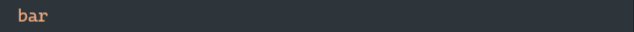
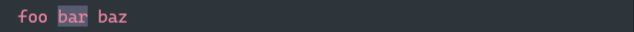
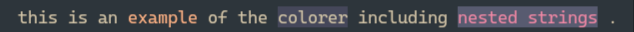

# colorer.py

A simple way to colorize terminal output with colors from base16 or base24 color schemes sourced from the tinted-theming project.
Supports foreground and background colors, as well as deeply nested combinations of background + foreground, foreground + foreground, background + background, etc.

## Prerequisites:

- The pyyaml python module
- A color-scheme yaml file from github.com/tinted-theming/schemes

## Usage:

- Import this module into your project
- Call fetch_palette(path_to_color_scheme) to load your color scheme

```python

  p = fetch_palette('./schemes/catppuccin-mocha.yaml')

```

- Colors can then be called with dot notation using the base-name from the scheme:

```python

  color = p.base09
  foo = 'bar'
  fg_foo = fg(color, foo)

  # you can also just call the color directly inside of the fg() or bg() functions:
  bg_foo = bg(p.base00, foo)


```

- Nest colors by passing a colorized string as the string to be colorized

```python

  nested_foo = fg(p.base00, bg(p.base06, foo))

```

- You can also nest in the middle of an fstring for highlighting and emphasis

```python

  emphatic_bar = fg(p.base08, f"foo {bg(p.base03, 'bar')} baz")

```

- Print the strings from variables

```python

  print(fg_foo)
  print(bg_foo)
  print(nested_foo)
  print(emphatic_bar)

```






- Or construct styled f-strings directly in the `print()`

```python

  print(
      f"this is an {fg(p.base09, 'example')} of the {bg(p.base08, 'colorer')} including {fg(p.base0E, bg(p.base02, 'nested strings'))} ."
  )

```


